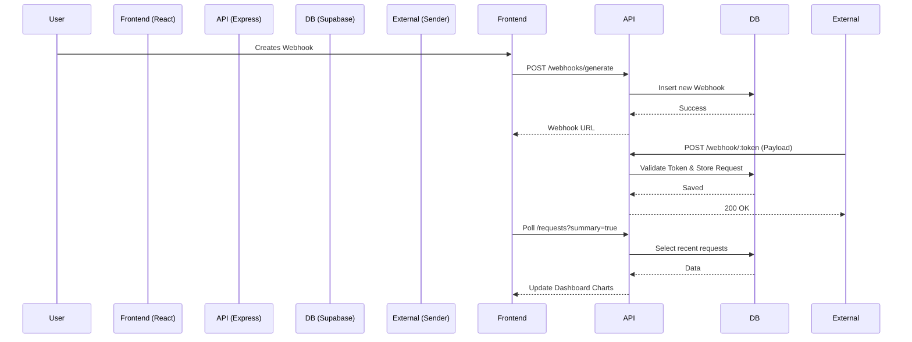

# Architecture Overview

## Webhook Inspection & Management Service

QimteK Webhook is a robust, full-stack application designed to capture, inspect, and manage webhook requests. It leverages a modern tech stack with React for the frontend and Node.js/Express + Supabase for the backend.

## Core Components

### 1. Webhook Management
- **Endpoint**: `POST /api/webhooks/generate`
- **Purpose**: Creates a unique, secure webhook URL.
- **Token**: UUID based.
- **Expiration**:
  - **Free Tier**: 72 hours.
  - **Professional/Admin**: Never expires (Permanent).
- **Storage**: Supabase (PostgreSQL).

### 2. Request Ingestion (The "Receiver")
- **Endpoint**: `ALL /api/webhook/:token`
- **Purpose**: Captures incoming HTTP requests.
- **Validation**:
  1. Checks if token exists.
  2. Checks if token is expired (Returns 410 Gone).
  3. Checks if webhook is active (Returns 403 Forbidden).
- **Captures**:
  - HTTP Method, URL, Headers, Body (JSON/Text/Form), Query Params.
  - Source IP, Timestamp.
  - Request Size (calculated for analytics).

### 3. Data Storage & Retention
- **Database**: **Supabase (PostgreSQL)**.
- **Retention Policy**:
  - **Free Tier**: Last 24 hours (configurable).
  - **Professional**: Unlimited retention.
- **Cleanup Job**: A background cron-like job (`api/utils/cleanup.ts`) runs periodically to remove expired webhooks and old requests.

### 4. Real-time Updates
- **Mechanism**: **Polling** (Client-side).
- **Interval**: Every 5 seconds.
- **Optimization**: Uses `?summary=true` parameter to fetch lightweight request lists (excluding large bodies) for the dashboard, fetching full details only when a specific request is selected.

### 5. Authentication & Security
- **Auth System**: JWT (JSON Web Tokens) + Bcrypt for password hashing.
- **MFA**: TOTP-based Two-Factor Authentication (optional).
- **RBAC (Role-Based Access Control)**:
  - Middleware checks `req.user.role` to authorize actions (e.g., Admin-only routes).

## Data Flow

## Scalability & Performance
- **Database**: PostgreSQL handles concurrent writes and complex queries efficiently.
- **Frontend Optimization**: `useMemo` is used for aggregating chart data to prevent UI blocking during rendering.
- **Payload Management**: Large request bodies are only loaded on-demand.

## Deployment
- **Frontend**: Served via Vite (can be static hosting).
- **Backend**: Node.js runtime.
- **Environment**: Configuration via `.env` (Port, Database Credentials, JWT Secret).
